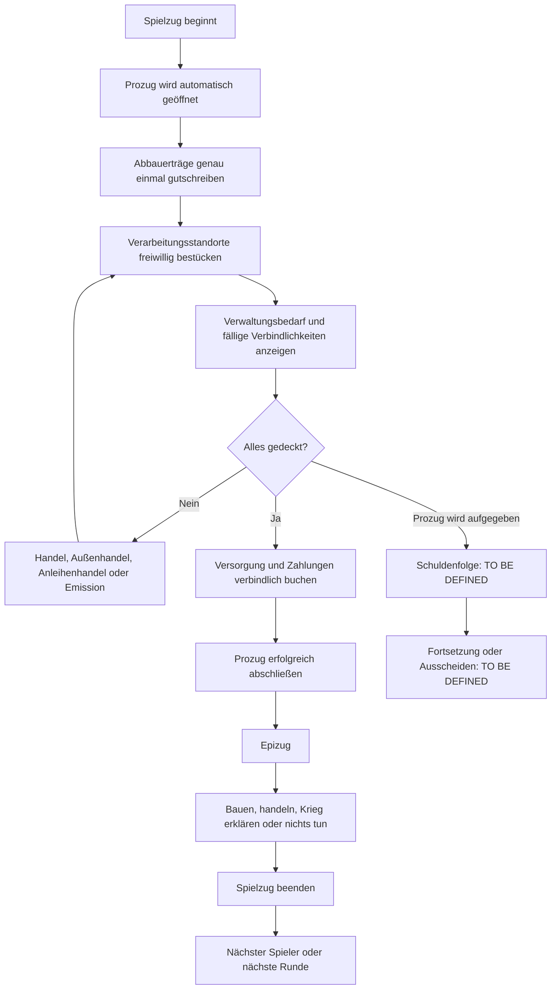

# Umbauplan: Spielzug aus Prozug und Epizug

Stand: 18.07.2026

## 1. Ziel und Geltungsbereich

Jeder reguläre Spielzug soll künftig genau aus zwei übergeordneten Phasen bestehen:

1. **Prozug:** automatisch geöffneter, verpflichtender Versorgungs- und Zahlungsdialog.
2. **Epizug:** freie Aktionsphase, in der gebaut, gehandelt, Krieg erklärt oder der Zug beendet werden kann.

Dieser Plan beschreibt den dafür nötigen Umbau von Fachmodell, Ereignissen, Regelwerk, App-Ablauf, Oberfläche, Speicherung, Tests und `docs/handbuch.tex`. Er ersetzt für den Bereich „Spielzug“ die bisher in `Umbau.md` beschriebene Dreiteilung in Einnahmen, Ausgaben und Aktionen. Die übrigen Architekturentscheidungen aus `docs/ARCHITEKTUR_ZIEL.md` bleiben gültig, insbesondere:

- `SpielZustand` ist die fachliche Wahrheit.
- Zustandsänderungen erfolgen ausschließlich über `SpielEreignis` und `SpielRegelwerk`.
- Das Legacy-Modell `datenbank.Spiel` darf für den neuen Spielzug nicht die maßgebliche Berechnungs- oder Buchungsquelle bleiben.
- Der Ereignisverlauf muss beim Synchronisieren, Rundenwechsel, Speichern und Laden erhalten bleiben.

Runde 0 bleibt ein eigener Spielabschnitt. Prozug und Epizug gelten erst ab `Spielabschnitt.REGULAER`.

## 2. Fachliches Zielbild



### 2.1 Prozug

Der Prozug ist kein bloßer Informationsdialog. Sein Abschluss muss durch tatsächlich gebuchte Rohstoffverbräuche und Geldzahlungen abgesichert sein.

Beim Beginn des Prozuges werden automatisch und genau einmal:

- der aktive Spieler und die Runde festgehalten,
- die Erträge aller angeschlossenen, aktiven Abbaustandorte ermittelt,
- diese Abbauerträge dem aktiven Spieler gutgeschrieben,
- die nutzbaren verarbeitenden Wirtschaftsstandorte ermittelt,
- alle zu versorgenden Verwaltungsstandorte ermittelt,
- alle in diesem Zug fälligen Zinszahlungen und Rückkäufe mit Empfänger ermittelt.

Im Prozug darf der Spieler:

- verarbeitende Wirtschaftsstandorte freiwillig mit Einsatzstoffen bestücken,
- die dadurch entstehenden Produkte erhalten,
- Rohstoffe mit Spielern oder dem Ausland handeln, soweit der jeweilige Handelsweg erlaubt ist,
- Anleihen emittieren,
- Anleihen handeln oder eigene Anleihen zurückkaufen, soweit sie noch handelbar sind,
- Verwaltungsstandorte versorgen,
- fällige Verbindlichkeiten bezahlen.

Der Prozug ist erfolgreich, wenn:

- jeder versorgungspflichtige Verwaltungsstandort vollständig versorgt ist und
- jede zu Beginn des Prozuges fällige Verbindlichkeit vollständig an den festgestellten Gläubiger bezahlt ist.

Eine manuelle Markierung wie „Finanzausgaben erledigt“ oder „Rohstoffausgaben erledigt“ darf dafür nicht genügen.

### 2.2 Epizug

Nach einem erfolgreichen Prozug beginnt der Epizug. Er besitzt keine Aktionspunktgrenze. Der aktive Spieler darf Aktionen in beliebiger Reihenfolge und beliebig oft ausführen, solange die jeweiligen Fachregeln erfüllt sind:

- Strukturen und Einheiten bauen oder aufwerten,
- Rohstoffe handeln,
- Außenhandel betreiben,
- Anleihen emittieren, handeln oder freiwillig zurückkaufen,
- Krieg erklären und weitere erlaubte Konfliktaktionen ausführen,
- auf weitere Aktionen verzichten und den Spielzug beenden.

Der Zugabschluss setzt den nächsten Spieler in den Prozug. Nach dem letzten Spieler wird zusätzlich die volle Runde abgeschlossen und die rundenbezogene Markt-/Leitzinsberechnung ausgeführt.

### 2.3 Erlaubnismatrix

| Aktion | Prozug | Epizug |
| --- | ---: | ---: |
| Automatische Abbauerträge | automatisch, einmalig | nein |
| Verarbeitungsstandort bestücken | ja | nein |
| Verwaltungsstandort versorgen | ja | nein |
| Fällige Zinsen/Rückkäufe bezahlen | ja | nein, weil vorher zu erledigen |
| Rohstoffhandel zwischen Spielern | ja | ja |
| Außenhandel | ja | ja |
| Anleihe emittieren | ja | ja |
| Anleihe handeln/freiwillig zurückkaufen | ja | ja |
| Struktur bauen/aufwerten | nein | ja |
| Krieg erklären | nein | ja |
| Zug beenden | nein | ja |
| Prozug als gescheitert erklären | ja, nach definierter Regel | nein |

## 3. Analyse des aktuellen Standes

### 3.1 Zugautomat

`domain/.../modell/ZugZustand.kt` kennt derzeit die drei Phasen `Einnahmen`, `Ausgaben` und `Aktionen`. `ZugAuswertung` ordnet Einnahmen, Rohstoffausgaben und Finanzausgaben als Pflichtschritte zu. Handel, Expansion und Krieg sind ausschließlich in `Phase.Aktionen` erlaubt.

Diese Struktur ist konzeptionell nah am gewünschten Ablauf, bildet aber den Prozug nicht als zusammenhängenden, iterativen Problemlösungsraum ab. Insbesondere ist Handel in der Ausgabenphase aktuell gesperrt, obwohl er künftig zum Schließen von Versorgungs- und Liquiditätslücken im Prozug benötigt wird.

### 3.2 Pflichtschritte werden nicht fachlich erfüllt

`GameViewModel.naechsterZugabschnitt()` erzeugt für jeden verfügbaren Pflichtschritt ein `SchrittAbgeschlossen` und schließt anschließend die Phase. Dabei werden:

- Verwaltungsverbräuche nicht vom Rohstoffbestand abgezogen,
- Zins- und Rückzahlungen nicht vom Geldkonto übertragen,
- einzelne Standorte und einzelne Verbindlichkeiten nicht als erfüllt nachgewiesen.

`AusgabenDialog` zeigt nur einen aus dem Legacy-Modell erzeugten `Ausgabenplan`. Der Button „Ausgaben abschließen“ schließt den Dialog und setzt den Ablauf fort, ohne die angezeigten Posten zu buchen. Das muss vollständig ersetzt werden.

### 3.3 Erträge und Verarbeitung

`KartenAuswertung.rohstoffErtrag()` behandelt sowohl Abbaueinheiten als auch `FeldAnlage.Wirtschaftsregion` als automatische Ertragsquellen. Bei verarbeitenden Standorten wie Raffinerie, Ziegelbrenner oder Stahlfabrik werden derzeit:

- keine Einsatzstoffe ausgewählt,
- keine Einsatzstoffe abgezogen,
- die Produkte automatisch und mit Anschlussstärke vervielfacht gutgeschrieben.

Damit fehlt genau die gewünschte Bestückungsentscheidung. Die Ertragsauswertung muss in automatische Abbauerträge und nutzergesteuerte Verarbeitung getrennt werden.

### 3.4 Verwaltungsbedarf hat zwei konkurrierende Quellen

Im Domain-Modell besitzen `BauteilTyp.BAHNHOF`, `GROSSBAHNHOF`, `HAFEN` und `GROSSHAFEN` Verbrauchsrezepte. Die aktuelle Zugauswertung prüft jedoch nur pauschal, ob der Spieler irgendein verbrauchendes Bauteil in `Spieler.bauteile` besitzt.

Der sichtbare Ausgabenplan wird dagegen aus `datenbank.Spieler.erhalteBauSaldoZurRunde()` des Legacy-Modells berechnet. Weder die konkrete Kartenposition noch der Zustand `INTAKT`, `BELAGERT` oder `ZERSTOERT` ist dabei maßgeblich. Für den Prozug muss die Karte die Quelle der aktiven Standorte sein; aggregierte Legacy-Bauteilzahlen dürfen nicht parallel entscheiden.

### 3.5 Anleihen und Fälligkeiten

Das Domain-Modell `Anleihe` enthält Emittent, Nennwert, Zinssatz und Laufzeit, aber keine Emissionsrunde, Fälligkeitsrunde, Zahlungshistorie oder einzelnen Forderungskennungen. `AnleiheFaellig` zahlt lediglich den Nennwert und entfernt die Anleihe. Eine laufende Zinszahlung wird im Domain-Modell nicht geplant oder als erfüllt verfolgt.

Das Legacy-Modell kennt dagegen folgenden Ablauf:

- vom Zug nach der Emission bis vor die Fälligkeit: Zahlung des `Unvermögens`,
- in der Fälligkeitsrunde: Rückkauf zum `Sondervermögen`,
- Empfänger ist der in der jeweiligen Runde aktuelle Besitzer.

Dieser Legacy-Ablauf ist bereits in Anzeigen und Tests vorhanden, widerspricht aber der offenen Formulierung im Handbuch. Vor der Implementierung muss er entweder als verbindliche Regel bestätigt oder bewusst ersetzt werden.

Auch der Außenhandel fehlt im Domain-Modell als vollständiger Akteur: `KontoId` kennt nur Spieler und Bank, und `SpielEreignis.RohstoffHandel` akzeptiert nur zwei Spieler. Der vorhandene Außenhandel wird aus dem Legacy-Modell berechnet. Damit „jede Form von Handel“ im Prozug tatsächlich denselben Bestand verändert, braucht der Außenhandel ein eigenes Domain-Ereignis oder ein explizites Auslandskonto samt Preis-, Aufschlags-, Abschlags- und Hafenvalidierung.

### 3.6 Bestehender Schuldenstrich passt nicht zum neuen Fehlschlag

`InsolvenzRegelwerk` löst den bestehenden Schuldenstrich nach mehr als drei friedlichen, aufeinanderfolgenden überschuldeten Zügen aus. Es prüft dabei bankgehaltene Gesamtschuld gegen Marktwert, aber nicht die im Handbuch verlangte gleichzeitige Verzettelung. Das Handbuch beschreibt wiederum einen sofortigen Schuldenstrich bei Überschuldung und Verzettelung.

Der neu gewünschte Fall „Prozug konnte Versorgung oder Zahlungen nicht erfüllen“ ist ein dritter, bisher nicht definierter Auslöser. Er darf nicht ungeprüft auf das bestehende Ereignis `Schuldenstrich` abgebildet werden.

### 3.7 UI- und Architekturgrenzen

- `Navigation.kt` öffnet den Ausgabendialog automatisch nur für `Phase.Ausgaben`.
- Handels- und Anleihedialoge mutieren zuerst das Legacy-`Spiel` und synchronisieren anschließend Teile in `SpielZustand` zurück.
- Dabei kann der Ereignisverlauf verloren gehen.
- Konfliktaktionen sind in `GameViewModel` derzeit ausdrücklich noch nicht verfügbar.
- Bauaktionen sind noch nicht als vollständiger produktiver Bildschirm angebunden.

Der Epizug kann daher nicht allein durch Umbenennen von `Phase.Aktionen` fertiggestellt werden. Handel, Bau und Konflikt müssen als vollständige vertikale Domain-Schnitte angebunden sein.

### 3.8 Speicherung

`FachSpielstand` speichert einen serialisierten Startzustand und Ereignisverlauf mit Formatversion 1. Neue serialisierte Phasen, Prozug-Daten, Produktionsentscheidungen und Anleihefälligkeiten benötigen:

- eine neue Spielstand-Formatversion,
- eine explizite Migration oder eine verständliche Ablehnung alter Fachspielstände,
- Tests für Speichern, Laden, Replay, Undo und Redo mitten im Prozug.

Die Room-Datenbank verwendet derzeit `fallbackToDestructiveMigration`. Das ist für eine veröffentlichte Migration riskant und muss vor einer Freigabe bewusst entschieden werden.

## 4. Vor der Implementierung verbindlich zu entscheidende Regeln

Die folgenden Punkte dürfen nicht durch zufällige UI- oder Datenmodellentscheidungen festgelegt werden.

| Nr. | Regelfrage | Empfohlene Arbeitsregel |
| ---: | --- | --- |
| R1 | Wann ist das Unvermögen fällig? | Bestehendes Legacy-Verhalten übernehmen: einmal je Spielzug ab der Runde nach Emission bis vor Fälligkeit; in der Fälligkeitsrunde nur Rückkauf des Sondervermögens. |
| R2 | Wer erhält eine im Prozug fällige Zahlung? | Gläubiger zu Beginn des Prozuges als Forderungsempfänger festschreiben. Späterer Handel ändert diese bereits fällige Forderung nicht. |
| R3 | Darf eine bereits fällige Anleihe im selben Prozug noch gehandelt werden? | Nein. Erst die fällige Zahlung/Rückzahlung; dadurch werden Umgehungen der Zahlungspflicht verhindert. |
| R4 | Wie viele Verarbeitungsläufe besitzt ein Standort? | Jeder angeschlossene Verarbeitungsstandort darf im Prozug höchstens einmal bewusst verwendet werden. Null Verwendungen bleiben erlaubt. |
| R5 | Wann werden Einsatz und Ertrag einer Verarbeitung gebucht? | Atomar bei der einmaligen Standortentscheidung: entweder vollständigen Einsatz abbuchen und vollständigen Ertrag gutschreiben oder gar nichts ändern. |
| R6 | Können mehrere Spieler denselben Wirtschaftsstandort im selben Rundenumlauf verarbeiten lassen? | Jeder angeschlossene Spieler erhält in seinem eigenen Prozug eine unabhängige einmalige Verwendungsmöglichkeit. |
| R7 | Welche Verwaltungsstandorte müssen versorgt werden? | Alle eigenen intakten Bahn-/Hafenstandorte einschließlich Hauptbahnhof auf der Karte. Wirkung belagerter Standorte ausdrücklich festlegen. |
| R8 | Was geschieht mit einem nicht versorgten Verwaltungsstandort? | Im neuen Ziel zunächst kein einzelnes Abschalten zulassen: Der Prozug ist insgesamt erfolglos. Die konkrete Schuldenfolge bleibt R12. |
| R9 | Welche Handelsarten umfasst „jede Form von Handel“ im Prozug? | Spielerhandel, Außenhandel, Sekundärhandel von Anleihen und freiwilliger Rückkauf; Geschäftsbank-Emission separat über die Emissionsaktion. |
| R10 | Wo liegt der Ereigniswurf künftig? | TO BE DEFINED. Empfehlung: als automatisch erzwungener Teil zu Beginn des Epizuges, bevor freie Aktionen möglich werden. |
| R11 | Wann darf ein Spieler den Prozug aufgeben? | Nur über eine ausdrücklich bestätigte Aktion „Prozug scheitern lassen“; keine automatische Heuristik, da Handelspartner noch helfen könnten. |
| R12 | Welche Folge hat ein erfolgloser Prozug? | TO BE DEFINED. Auslöser, gelöschte Forderungen, Gläubigerschutz, Infrastrukturfolgen, Kriegsmoratorium und Fortsetzung/Ausscheiden separat festlegen. |
| R13 | Bleibt der bisherige Überschuldungs-Schuldenstrich zusätzlich bestehen? | TO BE DEFINED. Die drei Auslöser Handbuch, Code und Prozug-Fehlschlag müssen zu genau einer konsistenten Regel zusammengeführt werden. |
| R14 | Werden Versorgungsbedarf und Fälligkeiten zu Beginn eingefroren? | Ja. Neue, im Prozug durch Handel erworbene Gebäude gibt es nicht; neu emittierte Anleihen erzeugen erst ab einem späteren Zug Zinsen. |
| R15 | Darf die Bank für Emissionen Geld schöpfen bzw. negativ werden? | Explizite Geldschöpfungsregel ergänzen. Der aktuelle Domain-Code verbietet ein negatives Bankkonto und kann sonst nicht jede Bankemission ausführen. |

Die Umsetzung der normalen Erfolgsschiene kann bis zur abstrahierten Fehlschlagsschnittstelle erfolgen. Das tatsächliche Ereignis für R12 darf erst implementiert und freigegeben werden, wenn die Regel entschieden ist.

### 4.1 Für die Umsetzung festgehaltene Arbeitsregeln

Für den Umbau vom 18.07.2026 gelten R1 bis R5, R7 bis R9, R14 und R15 gemäß der Empfehlung in der Tabelle. Zusätzlich gilt für R6 die unabhängige einmalige Verwendungsmöglichkeit je angeschlossenem Spieler und eigenem Prozug. Belagerte und zerstörte Verwaltungsstandorte erzeugen keinen Versorgungssnapshot. Eine fällige Anleihe bleibt bis zur Begleichung ihres festgeschriebenen Pflichtpostens für Handel und freiwilligen Rückkauf gesperrt. Eine Geschäftsbankemission schöpft den Emissionserlös ausdrücklich, ohne das Bankkonto negativ zu buchen.

R10 bis R12 bleiben sichtbar blockiert: Der Ereigniswurf ist noch nicht in den produktiven Zugablauf eingehängt, der Prozug besitzt keine Aufgabeaktion, und ein offener Prozug löst keine erfundene Schuldenfolge aus. Zu R13 bleibt der vorhandene, nach mehr als drei friedlichen aufeinanderfolgenden Überschuldungszügen fällige Schuldenstrich vorläufig zusätzlich bestehen; seine spätere Konsolidierung mit R12 ist weiterhin erforderlich.

Im Epizug sind Kriegserklärung und Friedensschluss als Domain-Ereignisse angebunden. Die alte, fachlich nicht definierte Ritterstufen-Schlachtauswertung ist aus der Oberfläche entfernt; sie wird nicht durch eine erfundene Konfliktfolge ersetzt.

## 5. Zielmodell im Domain-Modul

### 5.1 Zugstatus

Die bisherigen Phasen werden durch zwei Phasen ersetzt:

```kotlin
@Serializable
sealed interface ZugPhase {
    @Serializable data object Prozug : ZugPhase
    @Serializable data object Epizug : ZugPhase
}
```

Der `ZugStatus` benötigt eine stabile Zugkennung. Sie verhindert doppelte automatische Erträge nach Rotation, Prozessneustart oder Compose-Neuzusammensetzung.

```kotlin
@Serializable
data class ZugStatus(
    val zugId: Long,
    val spieler: SpielerId,
    val phase: ZugPhase,
    val prozug: ProzugStatus,
)
```

`ProzugStatus` speichert nur Tatsachen, die nicht zuverlässig aus dem aktuellen Bestand rekonstruiert werden können:

- ob der Prozug für diese Zugkennung begonnen wurde,
- die zu Zugbeginn festgeschriebenen Verwaltungsverpflichtungen,
- die zu Zugbeginn festgeschriebenen finanziellen Forderungen,
- gebuchte Produktionsentscheidungen je Standort,
- versorgte Verwaltungsstandorte,
- beglichene Forderungen,
- erfolgreichen oder gescheiterten Abschluss.

Der aktuelle Rohstoff- und Geldbestand bleibt im Spielerzustand; er wird nicht im Prozugstatus dupliziert.

### 5.2 Stabile Kennungen

Folgende Einträge brauchen stabile, serialisierbare Kennungen:

- `VerwaltungsVerpflichtungId(zugId, KartenEcke)`
- `ProduktionsStandortId(KartenFeld)`
- `VerbindlichkeitId(anleiheId, zugId, art)`
- gegebenenfalls `HandelsVorgangId`, falls Handel gegen doppelte Übermittlung abgesichert werden soll.

Ohne diese Kennungen lässt sich weder zuverlässig prüfen, ob ein einzelner Posten bezahlt wurde, noch lässt sich ein Event sicher wiederholen.

### 5.3 Produktionsmodell

`BauteilTyp` soll nicht mehr indirekt über `verbrauch.isEmpty()` klassifiziert werden. Eine explizite Produktionsart vermeidet Sonderfälle:

```kotlin
enum class ProduktionsArt {
    KEINE,
    ABBAU,
    VERARBEITUNG,
}
```

- Abbau: automatischer Ertrag, kein Einsatz.
- Verarbeitung: freiwilliger Einsatz und atomarer Produktertrag.
- Keine: beispielsweise Geschäftsbank.

Für jeden verarbeitenden Standort liefert eine reine Auswertung:

- Standort und Typ,
- vorhandener Transportanschluss,
- Einsatz je Lauf,
- Ertrag je Lauf,
- ob der Standort bereits verwendet wurde,
- ob der aktuelle Bestand für die einmalige Verwendung reicht.

`KartenAuswertung.rohstoffErtrag()` wird aufgeteilt, zum Beispiel in:

- `abbauErtrag(karte, spieler)`
- `verarbeitungsStandorte(karte, spieler)`
- `verwaltungsStandorte(karte, spieler)`

### 5.4 Verwaltungsverpflichtungen

Eine Verwaltungsverpflichtung verweist auf den konkreten Kartenstandort und enthält das vollständige Verbrauchsrezept. Der Bedarf wird aus Typ, Besitz und Kartenstatus ermittelt, nicht aus einer aggregierten Legacy-Anzahl.

Die Versorgung muss über ein eigenes Ereignis erfolgen. Eine allgemeine `RohstoffAusgabe` darf nicht automatisch als Standortversorgung gelten, weil sonst derselbe Verbrauch gleichzeitig für mehrere Verpflichtungen verwendet werden könnte.

### 5.5 Anleihe und Forderung

Das Domain-Modell der Anleihe wird mindestens ergänzt um:

- Emissionsrunde bzw. Emissionszug,
- berechnete Fälligkeitsrunde,
- Anleiheart bzw. ursprünglichen Erwerbertyp,
- vereinbarte Zinszahlungsregel,
- Status `OFFEN`, `FAELLIG` oder `AUSGELOEST`, sofern nicht vollständig ableitbar.

Eine `FaelligeVerbindlichkeit` ist ein aus der Anleihe und dem Besitzer abgeleiteter, für den konkreten Prozug festgeschriebener Posten:

- Art `UNVERMOEGEN` oder `RUECKKAUF`,
- Schuldner,
- Empfänger,
- Betrag,
- Anleihe-ID,
- Fälligkeitsrunde/Zug-ID,
- Zahlungsstatus.

Der freiwillige Rückkauf im Prozug oder Epizug ist ein Handelsvorgang. Der bei Fälligkeit verlangte Rückkauf ist eine Pflichtzahlung. Beide dürfen in Namen und Ereignissen nicht vermischt werden.

### 5.6 Ausland als Domain-Akteur

Für Außenhandel wird entweder `KontoId.Ausland` ergänzt oder ein eigenständiges, ebenso atomar validiertes Außenhandelsereignis eingeführt. Das Modell muss festlegen:

- wie Markzahlungen an das bzw. aus dem Ausland bilanziert werden,
- ob und wie ein ausländischer Rohstoffbestand begrenzt ist,
- welcher Marktpreis, Importaufschlag oder Exportabschlag gilt,
- welche Hafen-/Frachtschiffvoraussetzungen erfüllt sein müssen,
- wie der Außenhandel die Preisbildung der nächsten Runde beeinflusst.

Ohne diese Domain-Abbildung darf der Außenhandelsknopf zwar nicht nur das Legacy-Modell verändern; andernfalls würde der Prozug nach dem Handel weiterhin mit veralteten Beständen rechnen.

### 5.7 Reine Prozug-Auswertung

Eine neue `ProzugAuswertung` erzeugt aus `SpielZustand` ein UI-unabhängiges Ergebnis:

```kotlin
data class ProzugPlan(
    val spieler: SpielerId,
    val zugId: Long,
    val abbauErtraege: Map<Rohstoff, Int>,
    val produktionsStandorte: List<ProduktionsStandort>,
    val verwaltungsVerpflichtungen: List<VerwaltungsVerpflichtung>,
    val verbindlichkeiten: List<FaelligeVerbindlichkeit>,
    val fehlendeRohstoffe: Map<Rohstoff, Int>,
    val fehlendesGeld: Geld,
    val kannErfolgreichAbschliessen: Boolean,
    val sperrgruende: List<String>,
)
```

Die Abschlussfähigkeit wird ausschließlich daraus abgeleitet, welche konkreten Verpflichtungen gebucht sind. UI-Schalter oder alte `SchrittAbgeschlossen`-Ereignisse dürfen sie nicht setzen.

## 6. Neue und geänderte Ereignisse

Empfohlene Ereignisse:

| Ereignis | Wirkung |
| --- | --- |
| `ProzugBegonnen(zugId)` | validiert aktiven Spieler/Phase, schreibt Verpflichtungssnapshot und bucht automatische Abbauerträge genau einmal |
| `VerarbeitungAusgefuehrt(zugId, feld, laeufe)` | akzeptiert aus Kompatibilitätsgründen nur `laeufe = 1`, bucht Einsatz und Ertrag atomar und lehnt eine zweite Verwendung desselben Standortes im Prozug ab |
| `VerwaltungsstandortVersorgt(zugId, ecke)` | zieht das vollständige Rezept ab und markiert genau diesen Standort als versorgt |
| `VerbindlichkeitBeglichen(zugId, verbindlichkeitId)` | überträgt den exakten Betrag an den festgeschriebenen Empfänger und markiert die Forderung als bezahlt |
| `AnleiheEmittiert(...)` | legt die Anleihe mit Emissions- und Fälligkeitsdaten an und bucht den Emissionserlös atomar |
| `AnleiheFreiwilligZurueckgekauft(...)` | Handel/Rückkauf außerhalb einer Pflichtfälligkeit |
| `ProzugErfolgreichAbgeschlossen(zugId)` | nur möglich, wenn Versorgung und Forderungen vollständig erfüllt sind; wechselt in Epizug |
| `ProzugGescheitert(zugId, grund)` | zunächst nur als reserviertes Konzept; konkrete Folge erst nach R12 |
| `ZugBeendet` | nur im Epizug; wechselt zum nächsten Spieler und dessen noch nicht begonnenem Prozug |

`SchrittAbgeschlossen` und `PhaseAbgeschlossen` werden für den regulären Zug entfernt oder nur noch als Ladekompatibilität alter Ereignisverläufe behandelt. Sie dürfen keine neue fachliche Wirkung im Prozug besitzen.

Alle Ereignisse müssen im `ZugRegelwerk` einer Phase zugeordnet werden. Wiederholbare Aktionen wie Handel werden nicht als einmalig „erledigt“ markiert.

## 7. Atomarität und Ablaufsteuerung

### 7.1 Automatischer Start

Beim Übergang zum nächsten Spieler wird ein neuer `ZugStatus` mit neuer `zugId`, `Phase.Prozug` und `begonnen = false` angelegt. Die Spielsitzung erkennt diesen Zustand und sendet einmalig `ProzugBegonnen(zugId)`.

Das Ereignis muss idempotent abgelehnt oder wirkungslos bestätigt werden, wenn dieselbe Zugkennung bereits begonnen wurde. Dadurch führen UI-Recomposition, Rotation oder erneutes Sammeln eines Flows nie zu doppeltem Ertrag.

Ein gespeicherter Zustand mit `begonnen = false` ist zulässig. Nach dem Laden wird der Start automatisch nachgeholt. Ein gespeicherter Zustand mit `begonnen = true` öffnet nur den vorhandenen Prozug erneut.

### 7.2 Keine Teilbuchungen

- Verarbeitung bucht Einsatz und Ertrag in einer einzigen Regelwerksoperation.
- Rohstoffhandel bucht Ware und Geld weiterhin atomar.
- Emission legt Anleihe, Besitzer und Geldbewegung atomar an.
- Forderungszahlung überträgt Geld und setzt Zahlungsstatus atomar.
- Verwaltungsversorgung zieht alle benötigten Rohstoffe gemeinsam ab oder lehnt das Ereignis vollständig ab.

### 7.3 Snapshot gegen Regelumgehung

Verwaltungsbedarf und fällige Forderungen werden beim `ProzugBegonnen` festgeschrieben. Handel und Emission dürfen Bestände verändern, aber nicht die bereits entstandene Pflicht verschwinden lassen. Insbesondere darf ein Verkauf einer Anleihe nicht rückwirkend ändern, an wen eine bereits fällige Zahlung zu leisten ist.

## 8. Umbau nach Dateien und Verantwortungen

### 8.1 Domain-Modul

#### `modell/ZugZustand.kt`

- `Phase` durch `ZugPhase.Prozug/Epizug` ersetzen.
- `ZugStatus` um `zugId` und `ProzugStatus` erweitern.
- alte Schrittpflichten entfernen oder in reine Anzeigezustände überführen.

#### `modell/Bauteile.kt` und `modell/KartenBelegung.kt`

- Produktionsart explizit modellieren.
- Abbau und Verarbeitung fachlich unterscheiden.
- Rezepte weiterhin zentral und testbar halten.
- konkrete Kartenposition als Identität eines Standortes verwenden.

#### `modell/SpielZustand.kt` und `modell/Finanzen.kt`

- Anleihen um Emission/Fälligkeit/Zahlungsregel ergänzen.
- Forderungs- und Verpflichtungskennungen serialisierbar machen.
- gegebenenfalls explizites Zentralbank-Emissionskonto oder Geldschöpfungsereignis ergänzen.

#### `auswertung/KartenAuswertung.kt`

- automatische Erträge nur noch für Abbaustandorte berechnen.
- verarbeitende Standorte samt Kapazität getrennt liefern.
- aktive Verwaltungsstandorte anhand der Karte liefern.

#### Neue `auswertung/ProzugAuswertung.kt`

- Prozugplan, Deckung, offene Posten und Abschlussfähigkeit berechnen.
- keine Zustände verändern.

#### `auswertung/AnleihenAuswertung.kt`

- Fälligkeiten je Zug/Runde bestimmen.
- Empfänger und Betrag berechnen.
- freiwilligen Handel von fälligen Pflichtposten abgrenzen.
- Überschuldung nur nach der später verbindlich beschlossenen Schuldenregel berechnen.

#### `ereignis/SpielEreignis.kt`

- neue Prozug-, Produktions-, Versorgungs-, Emissions- und Zahlungsereignisse ergänzen.
- alte Phasenereignisse migrationsbewusst auslaufen lassen.

#### Neue `regelwerk/ProzugRegelwerk.kt`

- Beginn, Verarbeitung, Versorgung, Pflichtzahlung und Abschluss validieren und anwenden.
- keine UI-Texte oder Legacy-Typen verwenden.

#### `regelwerk/ZugRegelwerk.kt`

- Erlaubnismatrix Prozug/Epizug zentral durchsetzen.
- `ZugBeendet` nur im Epizug erlauben.
- neuen Spieler immer im unbegonnenen Prozug anlegen.

#### `regelwerk/AnleihenRegelwerk.kt`, `HandelsRegelwerk.kt`, `FinanzRegelwerk.kt`

- Emission und Rückkauf atomar ins Domain-Modell verlagern.
- Prozug und Epizug als erlaubte Handelsphasen berücksichtigen.
- Pflichtzahlungen nur über die konkrete Forderungs-ID anerkennen.
- Geldschöpfung/-vernichtung ausdrücklich statt als gewöhnliche Transaktion modellieren.

#### `regelwerk/InsolvenzRegelwerk.kt`

- erst nach R12/R13 umbauen.
- bestehenden Überschuldungsmechanismus nicht stillschweigend als Prozug-Fehlschlag wiederverwenden.
- Folgen auf Kartenbelegung und aggregierte Bauteile konsistent anwenden.

### 8.2 App-Modul

#### `datenbank/GameViewModel.kt`

- `naechsterZugabschnitt()` entfernen.
- konkrete Befehle anbieten: Prozug beginnen, Standort bestücken, Standort versorgen, Forderung bezahlen, Prozug abschließen, Zug beenden.
- automatischen Prozugstart zug-ID-sicher orchestrieren.
- Handels- und Anleiheaktionen als Domain-Ereignisse senden.
- den Ereignisverlauf bei Handel und Rundenbeginn nicht mehr zurücksetzen.

Mittelfristig gehört diese Orchestrierung entsprechend `docs/ARCHITEKTUR_ZIEL.md` in eine `SpielSitzung`; sie sollte nicht dauerhaft im bereits überladenen `GameViewModel` verbleiben.

#### `schnittstelle/eingabe/AusgabenDialog.kt`

- durch `ProzugDialog.kt` ersetzen.
- keine Legacy-Typen wie `datenbank.Ausgabenplan` erhalten.
- reinen `ProzugAnzeigeZustand` und konkrete Callbacks verwenden.

#### Neuer `schnittstelle/domain/ProzugAnzeigeZustand.kt`

- Domain-Auswertung in lokalisierte, formatierte UI-Zeilen überführen.
- Salden, Defizite, Status und Sperrgründe enthalten.
- keine Buchungslogik enthalten.

#### `Navigation.kt`

- Prozugdialog automatisch anzeigen, solange `zugStatus.phase == Prozug`.
- Dialog nicht durch Zurücktippen oder Außenklick umgehen lassen.
- Handel und Emission als Unterdialoge/Unterziele des Prozuges öffnen und anschließend in denselben Prozug zurückkehren.
- Epizugaktionen nur im Epizug erreichbar machen.

#### `schnittstelle/kategorien/Spielmenü.kt` und `domain/ZugAnzeige.kt`

- Text und Status auf Prozug/Epizug umstellen.
- im Prozug offenen Versorgungs- und Zahlungssaldo zeigen.
- im Epizug klaren Button „Spielzug beenden“ zeigen.
- Bau/Krieg/Handel abhängig von der Phase aktivieren; Handel bleibt in beiden Phasen aktiv.

#### `schnittstelle/eingabe/HandelsDialoge.kt`

- vom Legacy-`Spiel` entkoppeln.
- handelbare Bestände, Partner und Anleihen aus einem Domain-basierten Anzeigezustand beziehen.
- nach erfolgreicher Buchung den Prozugplan unmittelbar neu berechnen.

#### Bau- und Konfliktbereiche

- Bauaktionen vollständig über Karten-/Expansionsevents anbinden.
- Kriegserklärung und Konfliktaktionen aus dem derzeitigen „nicht verfügbar“-Stub in Domain-Ereignisse überführen.
- beide Bereiche im Prozug fachlich sperren.

### 8.3 Speicherung und Migration

- Formatversion des Fachspielstands erhöhen.
- Migrationsweg für `Phase.Einnahmen/Ausgaben/Aktionen` festlegen.
- Empfohlene Zuordnung für alte, noch nicht abgeschlossene Züge: immer in einen neuen, unbegonnenen Prozug überführen; keine alten erledigten Pflichtschritte als echte Zahlungen interpretieren.
- Alte Anleihen um Emissionsrunde und Fälligkeit ergänzen, soweit sie aus Legacy-Daten eindeutig rekonstruierbar sind.
- Nicht eindeutig migrierbare Zahlungshistorien mit verständlicher Meldung ablehnen oder als bewusst importierten Startzustand kennzeichnen; keine Zahlung erfinden.
- `SpielstandZuordnung`, Room-Rundlauf und Serialisierungstests aktualisieren.
- Destruktive Room-Migration vor Veröffentlichung entfernen oder als bewusste Datenlöschungsentscheidung dokumentieren.

## 9. Gestaltung des Prozugdialogs

Der Dialog soll den Spieler von oben nach unten durch die fachliche Aufgabe führen, ohne eine starre Reihenfolge innerhalb des Prozuges zu erzwingen.

### 9.1 Kopfbereich

- Spielername, Runde und „Prozug“.
- Gesamtstatus, zum Beispiel „2 von 4 Verwaltungsstandorten versorgt, 1 von 2 Zahlungen offen“.
- aktueller Geld- und Rohstoffbestand.
- Dialog ist verpflichtend und nicht einfach schließbar.

### 9.2 Automatische Erträge

- Liste der Abbaustandorte mit Standort, Anschlussstärke, Rohstoff und Menge.
- Gesamtsumme je Rohstoff.
- Kennzeichnung „bereits gutgeschrieben“ statt eines erneut ausführbaren Buttons.

### 9.3 Verarbeitung

Für jeden verarbeitenden Standort:

- Standort und Wirtschaftsart,
- Rezept „Einsatz → Ertrag“ je Lauf,
- Status „noch nicht verwendet“ oder „bereits verwendet“,
- Aktion „Einmal verarbeiten“,
- Einsatz und Ertrag der einmaligen Verwendung,
- verständlicher Grund, wenn der aktuelle Bestand nicht reicht,
- keine weitere Aktion nach erfolgreicher Verwendung im selben Prozug.

Das Auslassen der Aktion bleibt erlaubt. Verarbeitung ist eine Möglichkeit zur Deckung, keine eigene Abschlussbedingung.

### 9.4 Verwaltungsversorgung

- eine Zeile/Karte pro konkretem Bahnhof oder Hafen,
- Typ, Kartenposition und benötigte Rohstoffe,
- Status `offen`, `deckbar`, `versorgt`,
- Einzelaktion „versorgen“ und optional „alle deckbaren versorgen“ als Folge atomarer Ereignisse.

### 9.5 Fällige Verbindlichkeiten

- Anleihekennung,
- Art `Unvermögen` oder `Rückkauf`,
- Empfängername,
- fälliger Betrag,
- Status `offen`, `nicht gedeckt`, `bezahlt`.

Eine Zahlung darf nur mit ausreichendem Geld ausgelöst werden. Bereits bezahlte Forderungen bleiben sichtbar und können nicht doppelt bezahlt werden.

### 9.6 Liquiditätsaktionen im Dialog

Gut sichtbare Aktionen:

- „Rohstoff handeln“
- „Außenhandel“
- „Anleihe handeln/zurückkaufen“
- „Anleihe emittieren“

Diese Aktionen öffnen bestehende oder neu state-hoisted Unterdialoge. Nach jeder Aktion kehrt der Nutzer in denselben Prozug zurück; Bestände, Defizite und Abschlussfähigkeit werden aus dem neuen Domain-Zustand aktualisiert.

### 9.7 Abschluss

- Primäraktion „Prozug abschließen“ nur aktiv, wenn alle Pflichtposten tatsächlich gebucht sind.
- Bei Sperre werden fehlende Standorte und Forderungen genannt.
- Sekundäraktion „Prozug scheitern lassen“ erst nach definierter R12-Regel und mit Bestätigung der konkreten Folgen.
- Nach Erfolg wechselt derselbe Spieler ohne Zugwechsel in den Epizug.

## 10. Änderungen an `docs/handbuch.tex`

Das Handbuch kann nicht nur die Phasennamen austauschen. Mehrere bestehende Kapitel widersprechen dem gewünschten Ablauf oder dem aktuellen Fachmodell.

### 10.1 Titelseite und Begriffe

- `\DFVersion` und `\DFStand` aktualisieren.
- In „Zentrale Begriffe“ Definitionen für **Spielzug**, **Prozug**, **Epizug**, **Verwaltungsstandort**, **Wirtschaftsstandort**, **Abbaustandort**, **Verarbeitungsstandort**, **Versorgung**, **fällige Verbindlichkeit** und **Rückkauf bei Fälligkeit** ergänzen.
- `Unvermögen` nach Entscheidung R1 nicht mehr nur als Kennwert, sondern mit exaktem Fälligkeitszeitpunkt definieren.
- `Schuldenstrich` erst nach R12/R13 endgültig definieren.

### 10.2 Spielmaterial und Rohstoffe

Das Handbuch nennt aktuell nur Öl, Stahl, Ziegel und Nahrung. Der Code verwendet zehn Rohstoffe:

- Nahrung
- Lehm
- Ziegel
- Holz
- Rohöl
- Schweröl
- Diesel
- Kohle
- Stahl
- Eisen

Vor der Handbuchänderung ist zu entscheiden, ob diese zehn Rohstoffe die endgültige Regel sind. Wenn ja:

- Materialliste und Rohstoffkarten aktualisieren,
- das Kapitel „Rohstoffe“ vollständig auf zehn Rohstoffe umstellen,
- die pauschale Bezeichnung „Öl“ durch Rohöl, Schweröl und Diesel präzisieren,
- Verwendungen und Produktionsketten erklären.

### 10.3 Gebäude, Wirtschafts- und Verwaltungsstandorte

Die Gebäudetabelle muss alle vorhandenen Wirtschaftsstandorte enthalten:

- Viehhof
- Ziegelbrenner
- Lehmmine
- Förster
- Bohrturm
- Raffinerie
- synthetische Raffinerie
- Kohlemine
- Stahlfabrik
- Eisenmine
- Geschäftsbank

Für jeden Standort sind Produktionsart, Einsatz je Lauf und Ertrag je Lauf anzugeben. Die bisherige Sammelbezeichnung „Abbaueinheit“ reicht für Verarbeitungsstandorte nicht aus.

### 10.4 Fixkosten werden Prozug-Versorgung

Der Abschnitt „Fixkosten“ muss umbenannt und fachlich ersetzt werden:

- Versorgung findet im Prozug statt.
- Bedarf wird pro aktivem Verwaltungsstandort angegeben.
- Bahnhof/Großbahnhof verbrauchen Nahrung und Kohle, Hafen/Großhafen Nahrung und Schweröl, der Hauptbahnhof 3 Nahrung und 3 Kohle.
- Umgang mit belagerten, zerstörten und unverbundenen Standorten festlegen.
- vollständige statt nur „voraussichtliche“ Verbrauchstabelle einfügen.

### 10.5 Ertrag und Verarbeitung

Das Kapitel „Eigentum, Kontrolle und neutrale Anlagen“ wird in mindestens zwei Regeln getrennt:

1. **Automatischer Abbau:** Ertrag wird beim Beginn des Prozuges entsprechend Anschlussstärke gutgeschrieben.
2. **Freiwillige Verarbeitung:** Der aktive Spieler entscheidet im Prozug je Standort über null oder genau eine Verwendung und stellt die erforderlichen Einsatzstoffe bereit.

Zusätzlich sind R4 und R6 zu dokumentieren: höchstens eine Verwendung je Spieler-Prozug sowie Mehrfachnutzung durch verschiedene Spieler.

### 10.6 Anleihen und Zahlungen

Im Bankenkapitel müssen nach R1 bis R3 eindeutig beschrieben werden:

- Emissionsrunde,
- erste Zinsrunde,
- Höhe und Rundung des Unvermögens,
- jede weitere Zinsrunde,
- Fälligkeitsrunde des Sondervermögens,
- Empfänger bei zwischenzeitlichem Anleihenhandel,
- Handelssperre einer bereits fälligen Anleihe,
- Unterschied zwischen freiwilligem Rückkauf und verpflichtendem Rückkauf bei Fälligkeit,
- Reihenfolge mehrerer Zahlungen im Prozug,
- Behandlung einer nicht bezahlbaren Forderung.

Der bisherige offene Kasten zur Fälligkeit des Unvermögens wird anschließend entfernt.

### 10.7 Schuldenstrich und Zahlungsunfähigkeit

Die Kapitel „Überschuldung, Verzettelung und Schuldenstrich“, „Kriegsmoratorium“, „Zahlungsunfähigkeit“ und „Spielende“ müssen gemeinsam überarbeitet werden. Sie dürfen nicht drei unterschiedliche Insolvenzregeln enthalten.

Nach R12/R13 muss klar sein:

- welcher Zustand den Schuldenstrich auslöst,
- ob Prozug-Unterversorgung und Zahlungsunfähigkeit gleichbehandelt werden,
- welche Schulden erfasst sind,
- ob Spieler-Gläubiger entschädigt werden,
- welche Infrastruktur entfernt, abgestuft, zerstört oder neutralisiert wird,
- wie Kartenbelegung und Kontrolle geändert werden,
- ob Krieg die Folge aussetzt,
- ob und in welcher Phase der Spieler danach weiterspielt oder ausscheidet.

### 10.8 Ablauf einer Spielrunde

Das Kapitel wird vollständig neu strukturiert:

1. Runde und Spielerreihenfolge.
2. Beginn des Spielerzuges.
3. Prozug mit automatischen Erträgen, Verarbeitung, Versorgung, Zahlungen und erlaubter Liquiditätsbeschaffung.
4. erfolgreicher oder erfolgloser Abschluss des Prozuges.
5. Epizug mit Bau, Handel, Konflikt und freiwilligem Zugende.
6. Übergang zum nächsten Spieler.
7. Rundenende mit Preis-/Leitzinsberechnung.

Der bisherige Viererschritt „Erträge – Fixkosten – Ereignis – Bauen und handeln“ entfällt. Der Ereigniswurf wird entsprechend R10 neu eingeordnet.

### 10.9 Handel und Krieg

- Im Handelskapitel festhalten, dass Handel sowohl im Prozug als auch im Epizug erlaubt ist.
- Beschreiben, welche Handelsarten innerhalb des Prozugdialogs erreichbar sind.
- Im Kriegskapitel festhalten, dass eine Kriegserklärung nur im Epizug erfolgen kann.
- Falls Krieg weiterhin einen Schuldenstrich aussetzt, die Wechselwirkung mit einem bereits gescheiterten Prozug präzisieren.

### 10.10 Offene Regelfragen und Kurzreferenz

- Die Punkte R1 bis R15 in das Kapitel „Offene Regelfragen“ übernehmen, solange sie nicht entschieden sind.
- Entschiedene Punkte aus der offenen Liste entfernen und in die jeweiligen Regelkapitel einarbeiten.
- Kurzreferenz „Spielerzug“ vollständig auf Prozug/Epizug umstellen.
- Eine kompakte Prozug-Checkliste ergänzen.
- Den Anleihevordruck um Emissionsrunde, erste Zinsfälligkeit, Fälligkeitsrunde, bisherigen Zahlungsstatus und eindeutige Anleihekennung erweitern.

### 10.11 Handbuch-Prüfung

Nach den Textänderungen:

- alle Verweise auf Einnahmen-, Ausgaben-, Fixkosten-, Aktions- sowie Bau- und Handelsphase suchen und ersetzen,
- alle Vorkommen von vier Rohstoffen gegen die beschlossene Rohstoffliste prüfen,
- `pdflatex` mindestens zweimal ausführen, damit Inhaltsverzeichnis und Verweise stimmen,
- LaTeX-Warnungen auf überbreite Tabellen und ungültige Verweise prüfen,
- Kurzreferenz und Hauptkapitel gegeneinander lesen.

## 11. Umsetzungsetappen

### Etappe 0: Regeln festziehen und Bestand charakterisieren

Aufgaben:

- R1 bis R15 entscheiden oder ausdrücklich als Blocker markieren.
- Bestehende Zins-/Rückkaufberechnung mit Charakterisierungstests sichern.
- Bestehende Karten-Ertrags- und Verbrauchsrezepte sichern.
- Baseline `./gradlew test` und `./gradlew assembleDebug` ausführen.

Abnahme:

- Kein fachlich mehrdeutiger Punkt wird unbemerkt im Code entschieden.
- Die bestehende Datenlage und alle gewählten Übergangsregeln sind dokumentiert.

### Etappe 1: Domain-Auswertungen ohne UI-Änderung

Aufgaben:

- Abbau, Verarbeitung und Verwaltung trennen.
- Anleihefälligkeiten vollständig im Domain-Modell ausdrücken.
- `ProzugPlan` als reine Auswertung implementieren.
- Standort- und Forderungskennungen ergänzen.

Abnahme:

- Für einen beliebigen Zustand kann das Domain-Modul alle Prozugposten, Empfänger und Defizite korrekt anzeigen.
- Noch wird nichts automatisch gebucht.

### Etappe 2: Prozug-Ereignisse und Regelwerk

Aufgaben:

- Prozugstart, Produktion, Versorgung, Pflichtzahlung und Erfolgsabschluss implementieren.
- alte Pflichtschritt-Abkürzung entfernen.
- Erlaubnismatrix testen.
- automatischen Ertrag gegen doppelte Buchung absichern.

Abnahme:

- Ein vollständiger Prozug ist ausschließlich über echte Buchungen abschließbar.
- Jeder abgelehnte Vorgang lässt den Zustand unverändert.

### Etappe 3: Handel und Anleihen vertikal migrieren

Aufgaben:

- Rohstoff-, Außen- und Anleihenhandel aus dem Legacy-Schreibweg lösen.
- Emission und freiwilligen Rückkauf als Domain-Ereignisse implementieren.
- Zahlungsempfänger und Fälligkeit aus Domain-Daten ermitteln.
- Markt-/Anleihenhistorie für vorhandene Anzeigen erhalten.

Abnahme:

- Handel und Emission verändern denselben `SpielZustand`, aus dem der Prozugplan berechnet wird.
- Der Ereignisverlauf bleibt nach jeder Handelsaktion erhalten.

### Etappe 4: Speicherung und Spielsitzung

Aufgaben:

- Spielstandformat migrieren.
- automatischen Start über eine zug-ID-sichere Spielsitzung orchestrieren.
- Speichern/Laden mitten im Prozug prüfen.
- Rundenwechsel ohne Verlust des Ereignisverlaufs umsetzen.

Abnahme:

- Prozessneustart erzeugt weder doppelte Erträge noch verlorene Zahlungen.
- Undo/Redo rekonstruiert denselben Prozugstatus.

### Etappe 5: Prozugdialog

Aufgaben:

- `AusgabenDialog` ersetzen.
- alle Abschnitte aus Kapitel 9 umsetzen.
- Handels- und Emissionsunterdialoge anbinden.
- automatische, nicht umgehbare Anzeige bei Zugbeginn umsetzen.

Abnahme:

- Der Spieler kann Versorgungslücken erkennen, durch Verarbeitung/Handel/Emission schließen und den Prozug regelkonform abschließen.
- Der Dialog zeigt ausschließlich Domain-basierten Zustand.

### Etappe 6: Epizug vollständig anbinden

Aufgaben:

- Bau, Handel, Kriegserklärung und Zugende phasenabhängig anbinden.
- unproduktive Konflikt-Stubs ersetzen.
- nächster Spieler startet zuverlässig im Prozug.
- Ereigniswurf nach R10 integrieren.

Abnahme:

- Keine Epizugaktion ist im Prozug möglich.
- Alle vorgesehenen Epizugaktionen sind produktiv oder ausdrücklich aus dem Regelumfang entfernt.

### Etappe 7: Fehlschlag und Schuldenfolge

Blockiert durch R12/R13.

Aufgaben nach Entscheidung:

- eigenes Ereignis und Regelwerk für den Prozug-Fehlschlag implementieren,
- bestehendes Insolvenzregelwerk konsolidieren,
- Karten-, Anleihen-, Geld- und Spielerfolgen atomar anwenden,
- Bestätigungsdialog mit den konkreten Folgen ergänzen.

Abnahme:

- Ein gescheiterter Prozug führt deterministisch zu genau der beschlossenen Folge.
- Gläubiger-, Karten- und Speicherzustand bleiben konsistent.

### Etappe 8: Handbuch, Bereinigung und Freigabe

Aufgaben:

- Änderungen aus Kapitel 10 in `docs/handbuch.tex` umsetzen.
- alte Phasenbegriffe und Legacy-Ausgabenplan entfernen.
- nicht mehr verwendete Adapter erst nach dem letzten Aufrufer löschen.
- komplette Test- und PDF-Prüfung ausführen.

Abnahme:

- App, Domain-Regeln und Handbuch beschreiben denselben Ablauf.
- Kein produktiver Spielzug hängt mehr vom Legacy-`Spiel` als zweiter Wahrheit ab.

## 12. Testplan

### 12.1 Domain-Tests

- Prozug beginnt für den richtigen aktiven Spieler.
- Automatischer Abbauertrag wird genau einmal gebucht.
- Abbaustandorte und verarbeitende Standorte werden getrennt ausgewertet.
- Verarbeitung mit null oder genau einer Verwendung je Standort.
- Verarbeitung oberhalb der Kapazität wird abgelehnt.
- Verarbeitung mit fehlendem Einsatz wird ohne Teilbuchung abgelehnt.
- Mehrere Produkte eines Rezepts werden gemeinsam gebucht.
- Nur eigene, nach R7 aktive Verwaltungsstandorte werden verlangt.
- Standortversorgung zieht das exakte Rezept ab.
- Doppelte Standortversorgung wird abgelehnt.
- Fälliges Unvermögen nennt richtigen Betrag und Empfänger.
- Fälliger Rückkauf nennt richtigen Betrag und Empfänger.
- Pflichtzahlung ist geldsummenneutral.
- Doppelte Pflichtzahlung wird abgelehnt.
- Handel im Prozug verändert Deckung und Abschlussfähigkeit.
- Emission im Prozug verändert Liquidität und erzeugt keine sofortige Alt-Fälligkeit.
- Bau und Krieg werden im Prozug abgelehnt.
- Erfolgsabschluss mit offenen Posten wird abgelehnt.
- Erfolgsabschluss mit allen Posten wechselt denselben Spieler in den Epizug.
- Zugende im Prozug wird abgelehnt.
- Zugende im Epizug wechselt Spieler/Runde korrekt.
- Replay, Undo und Redo liefern identische Bestände und Status.
- Serialisierung erhält Prozug-Snapshots und stabile Kennungen.
- Nach R12: jeder Schuldenfolgefall einschließlich Krieg und Gläubigerentschädigung.

### 12.2 App-Tests

- Prozugdialog öffnet beim Spielzugbeginn automatisch.
- Zurücktaste und Außenklick umgehen den Dialog nicht.
- Rotation öffnet denselben Prozug ohne doppelte Erträge.
- Verarbeitung aktualisiert Bestände und Defizite sichtbar.
- Handel/Emission kehrt in denselben Prozug zurück.
- Abschlussbutton ist mit konkreter Begründung gesperrt.
- Bezahlte und versorgte Zeilen bleiben als erledigt sichtbar.
- Nach Erfolg verschwindet der Dialog und Epizugaktionen werden aktiv.
- Nach Laden eines Spielstands mitten im Prozug bleibt der Zustand identisch.
- Epizug-Zugende öffnet den Prozug des nächsten Spielers.

### 12.3 Integrations- und Freigabeprüfungen

Mindestens:

```text
./gradlew :domain:test
./gradlew :app:testDebugUnitTest
./gradlew :app:assembleDebug
./gradlew test
```

Zusätzlich instrumentierte Navigation-/Dialogtests und der LaTeX-PDF-Build, sobald die jeweiligen Etappen abgeschlossen sind.

## 13. Hauptrisiken und Gegenmaßnahmen

| Risiko | Gegenmaßnahme |
| --- | --- |
| Doppelte Ertragsbuchung durch UI-Lebenszyklus | stabile `zugId`, persistierter Startstatus, idempotentes Startereignis |
| Prozug zeigt andere Daten als Handel verändert | alle neuen Bereiche auf denselben `SpielZustand` und Ereignisweg migrieren |
| Verarbeitung erzeugt Rohstoffe ohne Einsatz | Abbau-/Verarbeitungstrennung und atomare Produktionsereignisse |
| Pflichtposten werden nur abgehakt | konkrete Standort-/Forderungs-ID und Buchung als einzige Erfüllung |
| Anleihehandel verschiebt fällige Zahlung | Forderungssnapshot zu Prozugbeginn und Handelssperre fälliger Anleihen |
| Alter Spielstand interpretiert Checkmark als Zahlung | alte Pflichtschritte nicht als Zahlungsnachweis migrieren |
| Schuldenstrich vernichtet widersprüchlich Daten | R12/R13 vor Implementierung entscheiden; eigenes atomar getestetes Ereignis |
| Karte und aggregierte Bauteile laufen auseinander | Karte als Quelle für aktive Standorte; Legacy-Zähler schrittweise entfernen |
| Rundenwechsel verliert Ereignisverlauf | Spielsitzung statt Neuerzeugung von `SpielAblauf` aus Zwischenzuständen |
| Handbuch bleibt fachlich widersprüchlich | Kapitel 10 als Abnahmekriterium, nicht als nachträgliche Kosmetik behandeln |

## 14. Definition of Done

Der Umbau ist abgeschlossen, wenn:

- jeder reguläre Spielzug sichtbar und fachlich aus Prozug und Epizug besteht,
- der Prozug bei Zugbeginn automatisch und ohne Umgehungsmöglichkeit erscheint,
- Abbauerträge genau einmal automatisch gebucht werden,
- verarbeitende Standorte nur nach Nutzerbestückung produzieren,
- jeder Verwaltungsstandort konkret und vollständig versorgt werden muss,
- jede fällige Zins- oder Rückkaufzahlung mit Betrag und Empfänger konkret bezahlt werden muss,
- Handel und Anleiheemission innerhalb des Prozuges Defizite schließen können,
- nur ein erfolgreicher Prozug in den Epizug führt,
- der definierte Fehlschlag deterministisch die beschlossene Schuldenfolge auslöst,
- im Epizug Bau, Handel, Kriegserklärung und freiwilliges Zugende funktionieren,
- der nächste Spieler wieder automatisch im Prozug beginnt,
- Speichern, Laden, Undo, Redo und Prozessneustart keine Buchung verdoppeln oder verlieren,
- `SpielZustand` und Ereignisverlauf die einzige fachliche Wahrheit des Spielzuges sind,
- `docs/handbuch.tex`, Kurzreferenz und App denselben Ablauf und dieselben Begriffe verwenden,
- Domain-, App-, Integrations- und PDF-Prüfungen erfolgreich sind.
